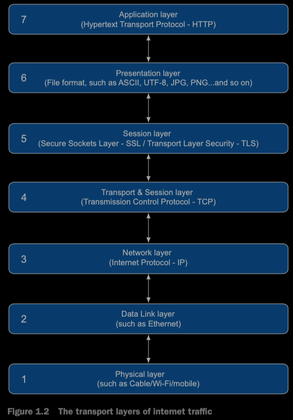

本章向你介绍当今Web工作原理，并解释本书其余部分的一些关键概念；然后介绍HTTP和其版本历史。我希望本书的读者至少对第一章的内容有所了解，当时也不要忽略它，利用本章来复习你的基础。

## 1.1 How the web works

略

### 1.1.1 The internet versus the World Wide Web

对很多人来说，internet和万维网是同义的，但是两者之间是有巨大差异的

internet是通过IP互联的公共计算机集合，通过IP传递来共享消息。提供了很多服务，包括万维网，email，文件分享和网络电话。万维网（或者叫web）作为internet的一部分，是其中最可视化的一部分。并且人们通常通过web-email的终端（比如Gmail，Hotmail和Yahoo）来查看email，有些也用web与internet进行交互

HTTP是web浏览器请求web页面的方式。这是Tim Berners-Lee发明web时定义的三种技术之一，另外两种是资源的唯一标识符（Uniform Resource Locators, 或者称为URLs）和超文本标记语言（Htypertext Markup Language, HTML）。internet的其他组成部分有自己的协议和标准来定义工作如何工作以及如何传递消息（比如email与SMTP，IMAP和POP）。在提到HTTP时，你主要与万维网交互，但是这条线越来越模糊，因为越来越多的服务构建在HTTP之上，不止于传统的web终端（译者注：一般是浏览器），这意味着web本身的定义越来越困惑。这些服务（比如REST或者SOAP）可以被web页面使用，也可以不是web页面（比如手机的app可以复用）。物联网中表示与其他设备进行交互的设备（计算机，手机app或者其他物联网设备），经常通过HTTP通信完成。结果就是，你可以使用HTTP通过手机app发送灯的开关指令。

尽管internet由无数的服务组成，但是随着web持续的增长，其他的服务使用者正越来越少。互联网早期中诸如BBS和IRC今天已经几乎消失了，取而代之的是web论坛，社交媒体网站和聊天应用。

所有这一切意味着，尽管术语World Wide Web和*the internet*不能直接画等号，随着web--至少HTTP使用的增长，两个术语的含义差距可能越来越小。

### 1.1.2 what happens when you browse the web?


## 1.2 What is HTTP?

上一节特意介绍了HTTP工作的详细流程，因此你可以理解HTTP如何适应更广泛的*internet*。本节，我简洁描述一下HTTP的工作原理和使用方法。

正如之前提到过的，HTTP代表*Hypertext Transfer Protocol*。顾名思义，HTTP最初旨在传输超文本文档（包括指向其他文档的链接的文档），第一个版本只支持文档。很快，开发人员意识到这个协议可以用于传输其他类型的文件（比如图片），所以HTTP的超文本部分不太具有意义，但是考虑到HTTP的广泛使用，现在对齐重命名已经为时已晚。

HTTP依赖于网络连接，通过由TCP/IP提供，建立一个物理层面的连接（Ethernet,Wi-Fi等）。因为通信协议是分层的，每层做好自己的事。HTTP不关心底层网络连接的建立过程。尽管HTTP应用应注意如何处理网络故障或者断开连接，但是协议本身不考虑这些问题。

OSI（Open Systems Interconnection）模型是一个概念模型，这个模型包含七层，尽管这个模型不能准确的对应真实网络中的情况，仍然经常用于描述网络的分层概念。TCP至少跨越了这个模型中的两层，也可能是三层，具体取决于怎么定义这些层。图1.2大致显示了该模型如何映射到Web流量和HTTP对应该模型的位置。



关于每层的确切定义确实存在一定争议。在internet这种复杂的系统中，并非所有内容都可以像开发者想象的那样严格进行分类分离。事实上，Internet工程组（IETF）警示了不要过于关注分层。但是这可以从较高的层次上帮助理解HTTP位于模型中的什么位置以及如何依赖底层进行工作。Many web applications are built on top of HTTP, so the Application layer, for example, refers more to networking layers than to JavaScript applications（译者注：本句不太会翻译:），直接放到这吧）

HTTP是一个请求-响应协议。web浏览器使用HTTP语法向服务器发出一个请求，响应的消息里附带了请求的资源。HTTP成功的关键是简单。正如你将在后面章节看到的，简单性也是HTTP/2的目标，不过为了效率牺牲了一些简单性。

HTTP请求的基本语法如下

```http
GET /page.html\n\r
```

结尾处是newline的表示。这就是HTTP最简单的表示，如此简单。表示你要GET资源/page.html。要记住的是，此时你已经使用比如TCP/IP连接了正确的服务器，所以你只需要简单向服务请求你想要的资源，而不用关注连接以及连接的管理。

HTTP的第一个版本（0.9）只有GET方法，这里你会疑惑为什么需要传递GET，因为在后面的版本中引入了更多的方法，因此对HTTP发明者预见了会有更多的方法表示敬意。下一节，将讨论HTTP的各个版本，不过语法还是这里GET这种格式。

