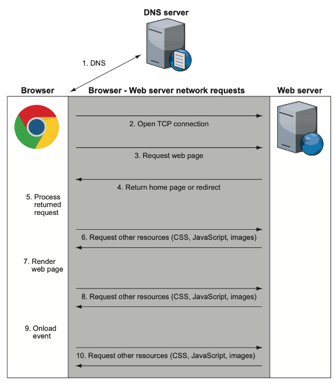
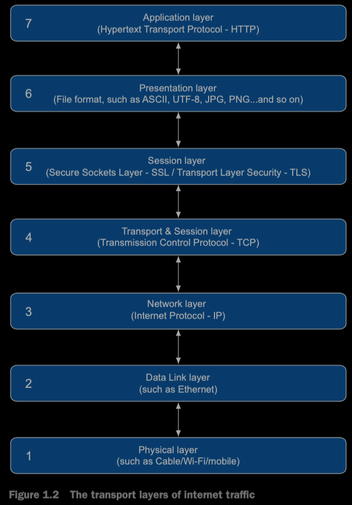
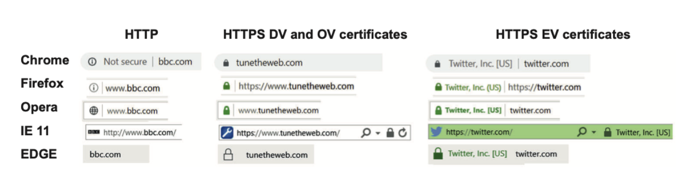

本章向你介绍当今Web工作原理，并解释本书其余部分的一些关键概念；然后介绍HTTP和其版本历史。我希望本书的读者至少对第一章的内容有所了解，当然也不要忽略它，利用本章来复习你的基础。

## 1.1 How the web works

略

### 1.1.1 The internet versus the World Wide Web

对很多人来说，internet和万维网是同义的，但是两者之间是有巨大差异的

internet是通过IP互联的公共计算机集合，通过IP传递来共享消息。提供了很多服务，包括万维网，email，文件分享和网络电话。万维网（或者叫web）作为internet的一部分，是其中最可视化的一部分。并且人们通常通过web-email的终端（比如Gmail，Hotmail和Yahoo）来查看email，有些也用web与internet进行交互

HTTP是web浏览器请求web页面的方式。这是Tim Berners-Lee发明web时定义的三种技术之一，另外两种是资源的唯一标识符（Uniform Resource Locators, 或者称为URLs）和超文本标记语言（Htypertext Markup Language, HTML）。internet的其他组成部分有自己的协议和标准来定义工作如何工作以及如何传递消息（比如email与SMTP，IMAP和POP）。在提到HTTP时，你主要与万维网交互，但是这条线越来越模糊，因为越来越多的服务构建在HTTP之上，不止于传统的web终端（译者注：一般是浏览器），这意味着web本身的定义越来越困惑。这些服务（比如REST或者SOAP）可以被web页面使用，也可以不是web页面（比如手机的app可以复用）。物联网中表示与其他设备进行交互的设备（计算机，手机app或者其他物联网设备），经常通过HTTP通信完成。结果就是，你可以使用HTTP通过手机app发送灯的开关指令。

尽管internet由无数的服务组成，但是随着web持续的增长，其他的服务使用者正越来越少。互联网早期中诸如BBS和IRC今天已经几乎消失了，取而代之的是web论坛，社交媒体网站和聊天应用。

所有这一切意味着，尽管术语World Wide Web和*the internet*不能直接画等号，随着web--至少HTTP使用的增长，两个术语的含义差距可能越来越小。

### 1.1.2 what happens when you browse the web?



如上图，假设你启动了一个浏览器，然后访问 www.google.com ，几秒内发生了如下事情：

1. 浏览器从 DNS(Domain Name System) 服务器获取域名 www.google.com 的真实 IP 地址
   如果你将 IP 地址看做电话号码，DNS 就是电话簿。IP 地址或者是老的 IPv4 地址（比如216.58.192.4，还比较对人友好）或者是新的 IPv6 地址（比如 2607:f8b0:4005:801:0:0:0:2004，则完全转向了机器友好）。IPv6 地址就是为了应对激增的“电话号码”。
   请注意，由于 Internet 的全球性，大公司通常在全球范围内有多个服务器。当你向 DNS 服务器请求 IP 地址时，通常会返回给你最近的服务器地址，使响应更快。例如，美国和欧洲会获取 www.google.com 的不同 IP 地址。
2. 浏览器会通过获取到的 IP 地址与标准端口（80或者443）与服务器开启一个 TCP 连接
   [略过关于 TCP/IP 的解释]
   一个服务器可以提供多个服务（email, FTP, HTTP/HTTPS web server），不同的端口允许将不同的服务集中在一个 IP 地址下，就像企业可能为每个员工提供电话分机。
3. 浏览器与 web 服务器建立连接之后，就可以开始请求站点。这里就是 HTTP 的工作原理了，将在下一节讨论，这里只需要通过 HTTP 协议向 Google 服务器请求 Google home 页面。如果使用 HTTPS，还有个额外建立加密 TCP 连接的部分
4. Google 服务器响应浏览器 URL 的请求。[略]
5. 浏览器处理返回来的响应。假定返回的是 HTML，浏览器开始解析 HTML 代码然后在内存中建立 DOM(Document Object Model)，页面的内部表示方式。整个处理过程中，浏览器加载页面显示需要的其他资源，例如 CSS， JavaScript 和图片。
6. 浏览器会请求所需要的资源。Google 保持了主页面的简介，只需要16个其他资源就可以完成加载。每个资源的请求都是通过类似的方式，从步骤1到步骤6，是的，包含本步骤，因为这些资源可能会反过来请求其他资源。一般的网站不像 Google 那么简洁，通常来自许多域名，所以必须不断重复步骤1-6。这是导致浏览器缓慢的主要愿意之一，这也是推动 HTTP/2 的原因，主要目的就是使得这些额外请求更快，这将在以后的章节讨论
7. 当浏览器有了足够的资源，就开始在屏幕上呈现页面。选择何时开始呈现是一个困难的任务。如果浏览器等所有资源下载到本地之后再呈现，就会很慢。但是如果渲染开始过早，就会导致页面一直刷新，如果你已经在阅读页面，这很烦人。对构成web页面的技术-- HTML/CSS/JavaScript 熟悉可以优化页面好用，但是很多网站没有优化
8. 在页面初始化完之后，浏览器继续在后台下载需要的资源，然后刷新加载，所以你可以看到没有图的页面，然后图再加载出来
9. 当页面完全加载完成，浏览器停止加载图标（大多数浏览器在地址栏上旋转的图标），并触发OnLoad JavaScript事件，这是JavaScript代码里获得页面已经加载完成的标志
10. 此时，页面加载完成，但是浏览器并没有停止发送请求。网页是静态信息的时代已经过去，现在许多网页都是功能丰富的应用，会与Internet 中的各种服务器通信，此内容可能是用户操作，比如在Google主页，输入搜索内容之后可以看到搜索建议而不必点击搜索按钮，或者应用驱动的动作，比如你的Facebook或者Twitter自动刷新而不必操作。这些动作通常发生在后台，是透明的，尤其是跟踪你在网站上的操作向网站所有者或者广告商发送分析报告。

正如描述的，当输入 URL 时发生了很多事情，几乎就在扎眼的瞬间这些事情就完成了。每个步骤都能展开一本书来讨论，本书着重并深入讨论步骤3-8（通过HTTP加载站点）。稍后的某些章节（尤其是第9章）涉及了步骤2（HTTP使用的底层网络连接）。

## 1.2 What is HTTP?

上一节特意介绍了HTTP工作的详细流程，因此你可以理解HTTP如何适应更广泛的*internet*。本节，我简洁描述一下HTTP的工作原理和使用方法。

正如之前提到过的，HTTP代表*Hypertext Transfer Protocol*。顾名思义，HTTP最初旨在传输超文本文档（包括指向其他文档的链接的文档），第一个版本只支持文档。很快，开发人员意识到这个协议可以用于传输其他类型的文件（比如图片），所以HTTP的超文本部分不太具有意义，但是考虑到HTTP的广泛使用，现在对齐重命名已经为时已晚。

HTTP依赖于网络连接，通过由TCP/IP提供，建立一个物理层面的连接（Ethernet,Wi-Fi等）。因为通信协议是分层的，每层做好自己的事。HTTP不关心底层网络连接的建立过程。尽管HTTP应用应注意如何处理网络故障或者断开连接，但是协议本身不考虑这些问题。

OSI（Open Systems Interconnection）模型是一个概念模型，这个模型包含七层，尽管这个模型不能准确的对应真实网络中的情况，仍然经常用于描述网络的分层概念。TCP至少跨越了这个模型中的两层，也可能是三层，具体取决于怎么定义这些层。图1.2大致显示了该模型如何映射到Web流量和HTTP对应该模型的位置。



关于每层的确切定义确实存在一定争议。在internet这种复杂的系统中，并非所有内容都可以像开发者想象的那样严格进行分类分离。事实上，Internet工程组（IETF）警示了不要过于关注分层。但是这可以从较高的层次上帮助理解HTTP位于模型中的什么位置以及如何依赖底层进行工作。Many web applications are built on top of HTTP, so the Application layer, for example, refers more to networking layers than to JavaScript applications（译者注：本句不太会翻译:），直接放到这吧）

HTTP是一个请求-响应协议。web浏览器使用HTTP语法向服务器发出一个请求，响应的消息里附带了请求的资源。HTTP成功的关键是简单。正如你将在后面章节看到的，简单性也是HTTP/2的目标，不过为了效率牺牲了一些简单性。

HTTP请求的基本语法如下

```http
GET /page.html\n\r
```

结尾处是newline的表示。这就是HTTP最简单的表示，如此简单。表示你要GET资源/page.html。要记住的是，此时你已经使用比如TCP/IP连接了正确的服务器，所以你只需要简单向服务请求你想要的资源，而不用关注连接以及连接的管理。

HTTP的第一个版本（0.9）只有GET方法，这里你会疑惑为什么需要传递GET，因为在后面的版本中引入了更多的方法，因此对HTTP发明者预见了会有更多的方法表示敬意。下一节，将讨论HTTP的各个版本，不过语法还是这里GET这种格式。

考虑一个实际中的例子，以下原文举例了使用Telnet/NC/windows网络连接工具连接www.google.com，然后手动输入HTTP命令获取响应，此处略去不翻译。

## 1.3 The syntax and history of HTTP

HTTP由Tim Berners-Lee和他的CERN研究团队在1989年提出。旨在成为一种实现互联计算机网络的方式，以提供对研究资料的访问并连接它们，以便它们可以轻松地实时互相引用，单击连接可以打开关联的文档。这种系统的idea已经存在很长时间，超文本这个词1960年代就被创造出来。随着互联网在1980年代的增长，可能可以实现这个idea了，在1989年和1990年，Berners-Lee提出了构建这样一个系统的建议，他构建了基于HTTP的第一个web服务，和第一个请求HTML并显示的web浏览器。

### 1.3.1 HTTP/0.9

第一个HTTP发布的规范是0.9版本，发布于1991年。规范文件少于700个单次。它指定通过TCP/IP（或者类似面向连接的服务）与服务器和可选端口（如果未指定端口，则使用80）建立连接。一行ASCII字符被发送，包含了`GET`和文档地址以及回车符和换行符（回车符可选）。服务端返回HTML格式的信息，定义为ASCII编码的字节流。它还指出，“消息通过服务器关闭连接而终止”，这就是为什么在先前的实例中每个请求之后关闭连接的原因。关于错误处理，规范指出“错误响应以HTML语法的可读文本形式给出，只能从内容上区分是正常响应还是错误响应”。它以以下文本结尾“请求是幂等的，服务端不需要在断开连接后保存任何请求的信息”。该规范给了我们HTTP的无状态部分，既是祝福（简单）也是祸根（因此必须使用HTTP cookies之类的技术来追踪状态，这对于复杂的应用是必需的）。

HTTP/0.9中只会存在下面这种命令

```http
GET /section/page.html \r\n
```

没有HTTP头部字段或者其他媒体诸如图片的概念。令人惊讶的是，这个简单的请求/响应协议（旨在提供研究资料的轻松访问）迅速催生了当今世界多媒体丰富的万维网。甚至从早期开始，Berners-Lee就将他的发明命名为万维网，再次表明了他对于这个项目的远见并计划将其打造为全球化的系统。

### 1.3.2 HTTP/1.0

万维网几乎马上就成功了。根据NetGraft数据，到1995年9月，万维网就有了19705台主机。一个月之后，这个数字跃升至31568，此后以惊人的速度增长。在撰写本文时，我们有了接近2亿个网站。到了1995年，HTTP/0.9的简单协议的限制已经显而易见了，并且大多数web服务器已经实现了超出0.9规范的扩展。HTTP工作组，由Dave Raggett牵头，开始修订一个更加通用的协议版本HTTP/1.0。在1996年5月以RFC1945发布。IETF发布RFC（征求意见）文档，可以被接受为正式标准或者保留为非正式文档。HTTP/1.0 RFC是一个非标准规范，在开头就描述自己为memo（备忘），“本备忘为互联网社区提供信息，本备忘未指定任何形式的互联网标准”。

无论正式与否，HTTP/1.0都添加了一些关键特性，包括

- 更多的方法：`HEAD`和`POST`被加入
- 对所有消息一个可选的HTTP版本号，为了向后兼容，默认是0.9版本
- HTTP头部，可以在请求和响应中提供资源的更多信息
- 一个三位数的响应代码，指示响应是否成功。此代码还使能了重定向请求，条件请求以及错误状态（404-Not Found是最出名的一个）

这些急需的协议功能通过使用自然而然的发生了，HTTP/1.0旨在记录现实中许多web服务器已经实现的功能，而不是定义新的选项。这些附加选项为web打开了很多新的机会，包括通过HTTP header声明body中的内容类型来在web页面中加入多媒体内容。

#### HTTP/1.0 METHODS

GET方法与HTTP/0.9中的大致相同，尽管header的添加允许有条件的GET（仅当自上次客户端获取的资源已更改时，才响应GET指令，否则回复资源未更改，客户端继续使用旧的即可）。而且，正如前面提到的，用户可以GET更多类型的资源，比如下载图片，视频和任何类型的多媒体资源。

HEAD方法允许客户端在不下载资源的情况下获取资源的元信息（比如HTTP header）。这个方法在很多情况非常有用。比如像Google这种网络爬虫，可以检查资源是否发生了变动，并且只在发生了改变的情况下才下载它，从而节省资源。

POST方法更加有趣，允许客户端发送数据到服务端。用户可以使用HTTP来发布文件，而不必使用标准的文件传输方法将新的HTML文件直接放到服务器上，只要将Web服务器设置可以接收数据并处理即可。POST不仅限于整个文件，可以用于更小的数据粒度。网站的表单通常使用POST方法，表单内容作为field/value对在HTTP请求的body中发送。因此POST方法允许将内容作为HTTP请求从客户端发向服务端，这表明HTTP请求也可以有body，像HTTP的响应一样。

事实上，GET可以通过query参数的方法传递给服务端，将参数以?的方式加载URL结尾。比如`https://www.google.com/?q=search+string`告诉了Google你正在搜索`search+string`。query参数是最早的统一资源标识符（Uniform Resource Identifier, URI）规范，但是旨在提供可选参数阐明URI，不是用作将数据上传到服务器。URL也被限制了长度和内容（比如不能包含二进制内容），一些敏感的信息（比如密码，信用卡信息等）不应该保存在URL中，会导致很容易被查看。因此，POST是发送数据的更好的选择，数据不可见（尽管通过HTTP发送的数据还是可以被看到，除非使用HTTPs，这后面会提到）。另一个GET方法和POST方法的不同时，GET是幂等的，POST不是，意味着多个相同的GET方法获取的响应是一样的，而POST的结果不一定相同。例如刷新网站的标准页面，会显示相同的内容，如果刷新电子商务网站，浏览器可能会提示你是否重新提交数据，这可能导致你购买额外的商品（尽管电子商务网站应该保证这种事情不会发生）

#### HTTP REQUEST HEADERS

HTTP/0.9中GET资源只有一行，HTTP/1.0引入了headers。header允许请求提供额外的信息，可以使服务端用来决定如何处理请求。HTTP header在原始请求行之后不同行提供，HTTP GET请求可以变成这样：

```http
GET /page.html HTTP/1.0
Header1: Value1
Header2: Value2

```

最后的换行符是必要的的，表示请求header部分已经完成

HTTP headers规范由header name，一个冒号，header内容组成，header name 不区分大小写。headers可以跨越多行当你以space或者tab开始一个新行时，但是不建议这样做，很少有客户端或者服务器使用此格式，并且可能无法正确处理它们。可以发送多个相同类型的header，它们在语义上与发送逗号分隔的版本是一样的，比如

```http
GET /page.html HTTP/1.0
Header1: Value1
Header1: Value2

```

与

```http
GET /page.html HTTP/1.0
Header1: Value1, Value2

```

意义是一样的。

尽管HTTP/1.0定义了一些标准header，本示例还演示了HTTP/1.0允许自定义header（比如上面的Header1）而无需更新协议版本。协议被设计为可扩展的。但是规范明确指出“不能假定接收者认识这些字段”，并且可能被忽略，而标准的header应有符合HTTP/1.1服务器处理。

一个典型的HTTP/1.0 GET如下所示：

```http
GET /page.html HTTP/1.0
Accept: text/html, application/xhtml+xml, image/jxr/, */*
Accept-Encoding: gzip, deflate, br
Accept-Language: en-GB, en-US,; q=0.8,en;q=0.6
Connection: keep-alive
Host: www.example.com
User-Agent: MyAwesomeWebBrowser 1.1

```

这个例子告诉服务器你可以接收的响应属于（HTML，XHTML，XML等），你可以接收几种编码（比如gzip，deflate和brotli，它们是用于压缩HTTP传输数据的方法），你更倾向于什么语言（GB English，然后是US English，再然后是另一种格式的英语），以及你使用的浏览器和版本（MyAwesomeWebBrowser 1.1）。还告诉服务端保持连接打开（这个话题后面会提到）。整个请求由两个return字符结束。从这里开始，出于可读性原因，后面回省略return字符。你可以假定最后一行有两个return字符。

#### HTTP RESPONSE CODES

典型的HTTP/1.0响应如下：

```http
HTTP/1.0 200 OK
Date: Sun, 25 Jun 2017 13:30:24 GMT
Content-Type: text/html
Server: Apache

<!doctype html>
<html>
<head>
...etc.
```

HTML剩余部分随后提供。正如所示，响应的第一行是响应消息的HTTP版本，一个三位的HTTP状态码（200），文本的状态描述（OK）。状态码和文本描述是HTTP/1.0的新概念，HTTP/0.9中没有状态码这种概念，错误只能在HTML本身中返回。下标表示了HTTP/1.0中定义的状态码

| Category             | Value | Descritpion           | Details                                                      |
| -------------------- | ----- | --------------------- | ------------------------------------------------------------ |
| 1xx（informational） | N/A   | N/A                   | HTTP/1.0没有定义1xx的状态码，不过定义了这个种类              |
| 2xx（successfule）   | 200   | OK                    | 这个代码是请求成功的标准响应码                               |
|                      | 201   | Created               | 这个代码只会响应POST方法                                     |
|                      | 202   | Accepted              | 这个请求被处理了但是尚未完成                                 |
|                      | 204   | No content            | 请求已被接收并处理，但是响应body没有发送回去                 |
| 3xx（redirection）   | 300   | Mutiple choices       | 这个代码不直接被使用，3xx类别意味着该资源存在与某一个（或者多个）位置，确切的响应提供了位置的更详细的信息 |
|                      | 301   | Moved permanently     | HTTP响应的 Location header应该提供资源的新URL                |
|                      | 302   | Moved temporarily     | HTTP响应的 Location header应该提供资源的新URL                |
|                      | 304   | Not modified          | 这个代码用来条件响应表示Body不需要再次被发送                 |
| 4xx（client error）  | 401   | Bad request           | 请求不能被理解，应该修改后重发                               |
|                      | 402   | Unauthorized          | 表示没有权限                                                 |
|                      | 403   | Forbidden             | 通常表示你没有权限，或者你没有访问的票据                     |
|                      | 404   | Not Found             | 最广为人知的HTTP状态码，经常出现在错误页面上                 |
| 5xx（server error）  | 500   | Internal server error | 由于服务器内部错误没有完成请求                               |
|                      | 501   | Not implemented       | 服务器不认识这个请求（比如没有实现的HTTP方法）               |
|                      | 502   | Bad gateway           | 服务器表现的像是网关或者代理，从下游服务返回错误             |
|                      | 503   | Service unvailable    | 服务器无法满足该请求，可能是因为服务器过载或者为了维护停机   |

精明的读者可能会注意到HTTP/1.0 RFC的早期草案中缺少一些状态码（203，303，402）。最终发布的RFC还删除了一些其他状态码。有些在HTTP/1.1中又被加上了，不过通常含义已经不同了。IANA（Internet Assigned Numbers Authority）维护所有HTTP版本中的所有状态码的完整列表，但是上表中HTTP/1.0中定义的状态码是最常用的那些。

显然有些响应含义是重叠的，比如一个不被服务端认识的请求可以是400（bad request）或者501（not implemented）。响应状态码被设计为表示宽泛的类型，每个应用程序都需要使用最合适的状态码。该规范还指出，响应状态码是可扩展的，因此可以根据需要添加新的状态码，而无需修改协议。这是对响应代码进行分类的一个原因。现有的HTTP/1.0客户端可能无法理解新的响应代码（比如504），但是知道该请求是由于某种原因在服务端失败，并且可以按照处理其他5xx代码的方式处理该请求。

#### HTTP RESPONSE HEADERS

在第一行之后，是HTTP/1 响应的Header。请求的Header和响应的Header格式是相同的。两个return字符分隔Header和Body，例子如下：

```http
GET / 
HTTP/1.0 302 Found
Location: http://www.google.ie/?gws_rd=cr&dcr=0&ei=BWe1WYrf123456qpIbwDg
Cache-Control: private
Content-Type: text/html; charset=UTF-8
Date: Sun, 10 Sep 2017 16:23:33 GMT
Server: gws
Content-Length: 268
X-XSS-Protection:1; mode=block
X-Frame-Options: SAMEORRGIN

<HTML><HEAD><meta http-equiv="content-type" content="text/html;charset=utf-8 ">                                                                              <TITLE>302 Moved</TITLE></HEAD><BODY>                                    <H1>302 Moved</H1>                                                      The document has moved <A HREF="http://www.google.ie/?gws_rd=cr&amp;dcr=0&amp;ei=BWe1WYrfIojUgAbqpI bwDg">here</A>.</BODY></HTML> Connection closed by foreign host.
```

随着HTTP/1.0的发布，HTTP语法得到了极大的扩展，使其能够创建动态的，功能丰富的应用程序，而不仅仅通过简单的HTTP/0.9版本所允许的内容。HTTP别变得更加复杂，从HTTP/0.9规范的大约700单次，增长到了HTTP/1.0的接近20000单词。但是即使该规范发布了，HTTP工作组也只是将其看做记录当前使用情况的权宜之计，然后开始着手HTTP/1.1。正如上面提到过的，HTTP/1.0更多是为了记录当时已经被广泛使用的情况，而不是为客户端和服务端实现定义新的语法。除了新的响应代码外，RFC的附录中还记录了其他方法（比如PUT，DELETE，LINK和UNLINK）和其他的HTTP Header，其中一些将在HTTP/1.1中标准化。HTTP的成功使得在发明五年之后工作组就要努力跟上实现的步伐。

### 1.3.3 HTTP/1.1

如你所见，HTTP是从版本0.9开始发布的，只提供了获取文本方法。这个版本从只处理文本发展到1.0，并在1.1版本中进一步标准化和完善。正如版本建议一样，HTTP/1.1是对HTTP/1.0的改进而不是颠覆的变革。从0.9版本到1.0是更大的改变，加入了HTTP Headers。HTTP/1.1进行了改进，使HTTP协议更好使用（比如持久连接，强制性服务器Header，更好的Cache选项和分块编码(chunk encoding)）。或许更重要的是，它提供了一个正式的标准，可以作为万维网未来的基础。尽管HTTP的基本内容很容易理解，还是有许多复杂的地方可以用不同的方式来实现，并且缺乏正式的标准使得难以扩展。

第一个HTTP/1.1的规范在1997年2月发布（HTTP/1.0发布九个月之后）。然后被1999年6月的版本代替然后再2014年有个第三个增强版本。每个版本都会废弃老的。HTTP规范现在有305页，接近100000单词，表明了这个简单协议的发展程度以及阐明如何使用HTTP是多么重要。事实上，在撰写本文时，该规范将再次更新，预计在2019年初发布。根本上，HTTP/1.1与HTTP/1.0没有太大的不同，但是web在过去20年的爆炸发展产生了丰富的附加功能，并要求文档提供精确的使用方法。

描述HTTP/1.1本身就可以完成一本书，所以这里尝试只讨论要点，以便为后面讨论HTTP/2提供背景和上下文。HTTP/1.1的许多附加功能是通过HTTP header引入的，而Header是在HTTP/1.0中引入的，意味着两个版本的HTTP基本结构上没有改变，尽管host header成为了必选项以及添加了持久连接与HTTP/1.0有显著不同。

#### MANDATORY HOST HEADER

HTTP请求行提供的URL（例如GET方法）不是绝对URL（http://www.example.com/section/page.html）而是相对URL（/section/page.html）。当HTTP被发明时，假定web服务器只有一个网站，即使上面部署了很多section和pages。因此URL的主机部分是显而易见的，因为用户必须在生成HTTP请求前连接web服务器。今天许多网站部署在同一个服务器上（被称为*virtual hosting*），所以告诉服务器时那个网站就变得与URL一样重要了。这个特性可以通过改变URL为绝对的解决，但是这个改变将会打破很多现有的网站运行方式。所以这个特性通过添加Host header来支持：

```http
GET / HTTP/1.1
Host: www.google.com

```

这个header在HTTP/1.0是可选的，但是HTTP/1.1是必填的。下面的请求是错误的

```http
GET / HTTP/1.1

```

根据HTTP/1.1规范，这个请求应该被服务器拒绝，返回400错误码，尽管大多数Web服务器宽容这种情况，并为此类请求返回默认主机。

让Host Header称为必填项是HTTP/1.1重要的一环，允许服务器使用虚拟主机，满足了web服务的巨大增长而无需为每个站点提供单独的服务器。此外，如果不进行此更改，IPv4 的IP地址将很快耗尽。另一方面，如果没有实施该限制，也许会迫使人们更早转向IPv6，IPv6推广过程已经持续了20多年。

强制Host Header而不是强制绝对URL引起了一些争议。HTTP/1.1中引入的HTTP 代理允许通过客户端通过代理连接HTTP服务器。代理的语法要求所有请求的URL是绝对URL，但是实际的（也称为原始服务器）被强制使用Host header。如上所述，这个保证了向后兼容，但是强制使用Host也使得HTTP/1.1客户端和服务端必须使用虚拟主机格式的请求才能完全兼容HTTP/1.1的实现。有人认为将来的某个HTTP版本，可以更好处理这种情况。HTTP/1.1规范中指出，“为了允许将来某个HTTP版本转换所有请求为绝对URL，服务器必须接受请求的绝对格式URL，即使客户端只发送这种请求到代理”。不过，如你稍后所见，HTTP/2不能彻底解决这个问题，而是将Host Header替换为:authority pseudoheader field（参阅第4章）。

#### PERSISTEN CONNECTIONS(AKA KEEP-ALIVES)

HTTP/1.1引入的另一个重要变化时持久连接的引入，尽管HTTP/1.0中没有提到，但是实际上很多HTTP/1.0服务是支持的。最初，HTTP是一个单次请求-响应协议。客户端打开链接，请求资源，获得响应，关闭连接。随着web越来越富媒体，关闭连接太浪费。展示一个单独的页面需要多个HTTP资源，所以关闭连接重连导致了不必要的延迟。这个问题可以使用新的Connection Header来解决，可以随着请求一起发送。通过这个header指定keep-alive，客户端告诉服务器保持这个连接以发送其他请求。

```http
GET /page.html HTTP/1.0
Connection: Keep-Alive

```

服务器如果支持持久连接，响应中也包含Connection: Keep-Alive

```http
HTTP/1.0 200 OK 
Date: Sun, 25 Jun 2017 13:30:24 GMT 
Connection: Keep-Alive 
Content-Type: text/html 
Content-Length: 12345 
Server: Apache 

<!doctype html> <html> <head> …etc.
```

这个响应告诉客户端，响应完成后，他可以在同一个连接上发送另一个请求，因此服务器不必关闭这个连接。当使用持久连接时知道何时响应完成变得更加复杂，连接关闭是一个很好的信号，表示服务端已经完成响应。替代方案是Content-Length HTTP header必须加入，表示响应消息的长度，当整个body都接收完成，客户端才可以发送另一个请求。

客户端或者服务器可以随时关闭HTTP连接，关闭可能是偶然的（比如由于网络错误）也可能是故意的（例如，如果一段时间未使用某个连接，并且服务器决定关闭它来重新连接到其他客户端）。因此即使具有持久连接，客户端和服务器也应该监视连接并可以处理意外的连接关闭。对于某些场景，这种请求可能变得更复杂。如果你要在电子商务网站上结账，可能不想在不检查服务器是否处理了原请求的情况下重新发送请求。

HTTP/1.1不仅将持久连接添加到了标准中，还进一步将其定义为默认选项。即使响应中不存在Connection header，也可以假定任何HTTP/1.1连接都在使用持久连接。如果服务器确实由于某种原因希望关闭持久连接，需要在响应中显示给出 Connection: close Header。

这里给出了可以Telnet测试一下三种情况

- HTTP/1.0不带Connection
- HTTP/1.1带Connection
- HTTP/1.1不带Connection

类似的主题，HTTP添加了pipeline，因此可以在同一持久连接上发送多个请求，并按顺序返回响应。如果web浏览器正在处理HTML文档，并且发现它需要一个CSS文件和一个JavaScript文件，可以将这些文件的请求一起发送，而不必先请求一个等收到响应之后在发送一个请求。这是一个例子：

```http
GET /style.css HTTP/1.1 
Host: www.example.com 

GET /script.js HTTP/1.1 
Host: www.example.com 

HTTP/1.1 200 OK 
Date: Sun, 25 Jun 2017 13:30:24 GMT 
Content-Type: text/css; charset=UTF-8 
Content-Length: 1234 
Server: Apache 

.style { …etc. 

HTTP/1.1 200 OK 
Date: Sun, 25 Jun 2017 13:30:25 GMT 
Content-Type: application/x-javascript; charset=UTF-8 
Content-Length: 5678 
Server: Apache 

Function( …etc.
```

由于一些原因（这里将会在第2章深入），pipeling没有被实现过，并且在浏览器和服务端的支持都很差。因此，即使持久连接允许多个请求重复利用，并且有性能提升，HTTP/1.1基本上还是一个请求-响应协议。当一个请求被处理同时，HTTP连接是被blocked的不能发送其他请求。

#### OTHER NEW FEATURES

HTTP/1.1还引入了很多其他特性，包括：

- 除了HTTP/1.0中的GET，POST，HEAD之外，新引入了PUT，OPTIONS和很少用的CONNECT，TRACE，DELETE
- 更好的缓存方法。这些方法允许服务器告诉客户端在浏览器缓存中保存资源（比如CSS文件），在必要的时候可以重复利用。Cache-Control HTTP header比1.0版本引入的Expires有更多的可选项
- HTTP cookies可以将从无状态协议中增强为有状态
- 响应中字符集和语言的引入
- 支持代理
- 鉴权
- 新的状态码
- Trailing Headers（在第4章中，4.3.3小节讨论）

HTTP不断添加新的HTTP header以进一步扩展功能，许多处于性能或者安全性原因。HTTP/1.1并没有表示最终定义，并鼓励添加新的header，甚至专门介绍了如何在文档中定义新的header。正如我之前提到的。这些headers中有些是为了安全原因，然后允许网站告诉web浏览器打开某些可选的安全保护，所以服务端没有任何实现（除了发送header）。同时，header中X-的惯例是这不是标准规范中定义的header（X-Conten-type，X-Frame-Options，X-XSS-Protection），但是这个惯例已经作废，新的实验性的header已经很难与HTTP/1.1标准区分开了，通常这些header有自己的RFC（Content-Security-Policy，Strict-Transport-Security等）。

## 1.4 Introduction to HTTPS

HTTP是文本协议。HTTP消息在网络中传输没有经过加密，因此看到该消息的任何一方都可以读取。顾名思义，计算机网络，不是端对端系统。Internet 无法控制消息的路由方式，作为 Internet 用户，你不知道从 ISP(Internet Service Provider) 到电信公司通过了那些组织的网络，还有多少其他地方可以看到你的消息。由于 HTTP 是纯文本格式，消息可以在中转途中被拦截，甚至被修改。

HTTPs 是一个通过 TLS(Transport Layer Security) 协议加密版本的 HTTP，尽管它的前身 SSL(Secure Sockets Layer) 的名字更广为人知 ，如下所述

HTTPS 往 HTTP 消息里加入了三个重要概念：

- Encryption -- 消息在传递过程中不能被第三方读取
- Integrity -- 消息不能再传递过程中修改，整个消息做了数字签名，并且在解密之前对该签名进行了验证
- Authentication -- 服务器是你想要通信的那个

> **SSL, TLS, HTTPS and HTTP**
>
> HTTPS 使用 SSL 或者 TLS 提供加密。SSL 由网景发明，SSLv1 没有公开发布，所以第一个版本是 SSLv2，在1995年发布。SSLv3 在1996年发布，提升了安全性
>
> SSL 由网景拥有，尽管后来 IETF 将其作为历史文档发布了，但是不是正式的互联网标准。SSL 被标准化为 TLS。TLSv1.0 与 SSLv3 是相似的，但是不兼容。TLSv1.1 与 TLSv1.2 分别在2006年和2008年发布，更加安全。TLSv1.3 已经在2018年成为标准，更加安全和高效，尽管要花很多时间才能广泛使用
>
> 尽管有了更新更安全的标准化版本，许多人觉得 SSLv3 已经够好了，所以即使很多客户端已经支持了 TLSv1.0， 很长一段时间 SSLv3 还是事实标准。然而，在2014年，SSLv3 被发现了一个重大漏洞，浏览器将不再支持这个版本，这导致了向 TLSv1.0的大迁移。在 TLSv1.0 也被发现重大漏洞之后，安全准则要求使用 TLSv1.1 或者更高版本
>
> 所有这些历史导致人们以不同的方式使用这些首字母缩写。长期以来，许多人仍然使用 SSL 作为加密名词，其他的则使用 SSL/TLS 或者 TLS。有些人试图使用 HTTPS 来避免这些名词冲突，即使这也不那么准确
>
> 本书中，我使用 HTTPS（而不是 SSL或者 SSL/TLS）来描述加密，除非我要讨论 TLS 协议的特定部分。类似的，我将 HTTP 的核心语义称为 HTTP，无论用于加密的 HTTPS 连接还是未加密的 HTTP 连接。

HTTPS通过公钥加密工作，在第一次与服务器通信时，公钥由服务器提供。你的浏览器使用公钥加密消息，只有提供公钥的服务器能解密。这个系统允许你在不知道共享秘钥的情况下与网站通信，这对于Internet这样的系统至关重要，因为每时每刻都有新的网站和用户。

数字证书是由浏览器信任的CA机构签发并进行了数字签名，这就是可以验证公钥是否适用于你要连接的服务器的原因。HTTPS 一个大问题是，只能表明你连上了公钥对应的网站，但是这不表明网站本身是安全的。伪装站点使用类似的域名（比如exmplebank.com 与 examplebank.com）建立钓鱼网站。HTTPS站点通常在浏览器显示为绿色的锁，许多用户将其视为安全，但是这仅意味着加密。

一些 CA 颁发证书时，提供扩展验证证书（称为 EV 证书），该证书与普通证书相同的方式对 HTTP 通信进行加密，不过大多数浏览器会显示公司名称。比如下图



许多人对 EV 证书的好处提出质疑，因为大多数用户并没有注意到公司名称，然后将 EV 证书与 DV 证书的站点区分出来。中间组织 OV 会对证书做一些检查，但是不会给浏览器额外的通知，从而在技术层面显的毫无意义（尽管在购买证书时，CA会对额外支持作出承诺）。

在撰写本文时，Google Chrome小组正在研究和试验这些安全性指标，尝试移除一些没有必要的信息，包括 scheme（http和https），www 前缀，甚至可能挂锁本身（而是假设 HTTPS 是正常的，将 HTTP 明显标记为不安全）。同时他们也在考虑是否删除 EV。

HTTPS 围绕 HTTP 构建，并且几乎与 HTTP 协议本身无缝连接。默认情况下，托管在其他端口（443端口而不是HTTP标准的80端口），有不同的 scheme （https:// 而不是 http://），但是除了加密和解密之外，对HTTP协议的语法没有任何改变

当客户端连接 HTTPS 服务器时，经过一个协商阶段（TLS 握手）。在这个过程总，服务器提供公钥，客户端与服务端关于加解密算法达成一致，然后协商一个未来通信使用的 encryption key（公钥加密很慢，所以公钥加密秘钥只用来协商共享秘钥，共享秘钥性能更好）。将在第4章详细讨论 TLS 握手过程（4.2.1）

在 HTTPS 会话初始化完成后，将交换标准 HTTP 消息，客户端和服务端将在发送消息前先对这些消息进行加密，然后再传输，然后解密，对于普通的 Web 开发人员和服务管理员来说，配置 HTTPS 和 HTTP 没有任何区别。除非你要查看网络收发的原始消息，否则一切都是透明的。HTTPS 将标准 HTTP 请求和响应封装起来而不是替换成另一个协议。

HTTPS 是一个巨大的话题，远远超出了本书的范围。由于HTTP/2确实在这方面有一些变更，在未来的章节会在此简单提到。但是现在，只要知道 HTTPS 的存在，并且在不影响 HTTP 标准协议的底层运行就行。除非你要看加密消息本身，否则你感受不到 HTTPS 和 HTTP的不同。

对于使用 HTTPS 的服务器，你需要一个能理解 HTTPS 并加解密的客户端，所以你不能再用 Telnet 发送 HTTP 请求。 OpenSSL 提供了一个 s_client 命令让你可以向 HTTPS 发送 HTTP 命令，使用方式类似 Telnet：

```shell
openssl s_client -crlf -connect www.google.com:443 -quiet
GET / HTTP/1.1
Host: www.google.com

HTTP/1.1 200 OK
...etc
```

我们马上结束使用难用的命令行工具来试验 HTTP 请求的时代。下一节，我将要简要介绍浏览器工具，提供了更易用的方式。

## 1.5 Tools for viewing, sending, and receiving HTTP messages

略